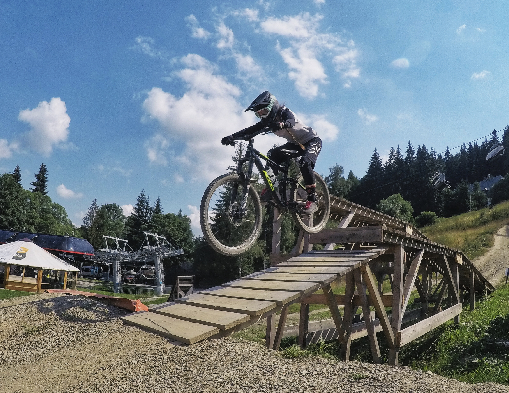

## Hello, I'm Ewa 🦊 

I'm Ewa Lis, junior Front-end developer. I've just finished my JavaScript course organised by an IT school - Coders Lab. 
Thanks to this course I've learned programming fundamentals and gained skills that allows me to create responsive web designs. 

#### Technologies that I use: 

## :mailbox: Reach me!

#### Portfolio: https://ewalis1.github.io

## 🚵🏼‍♀️ My interests and hobbies:
- coding of course 😉💻
- MTB (enduro) 🚵🏼‍♀️
- jogging 🏃🏼‍♀️
- Standup paddle 🏄🏻‍♀️
- Yoga 🧘🏼‍♀️
- aerial hammock 🤸🏼‍
- reading fantasy books and about personal growth 📖
- DIY (I enjoy making candles, soaps or decoupage) 🛠

## 📚 Planning to learn:
- more JavaScript
- simple tests
- TypeScript
- .NET
- Angular

## 📈 Some Github stats
&nbsp;&nbsp;&nbsp;&nbsp;&nbsp;&nbsp;

## 😂 Here is a random joke that'll make you laugh!

